# Data model

How the extension is structured inside the process. Five layers, each owned by the one above it, with the DuckDB `DatabaseInstance` at the top and a TCP socket at the bottom.

## Primer (user perspective)

Each `ATTACH '…' AS db (TYPE mssql)` creates exactly one `MSSQLCatalog` inside DuckDB. That catalog owns **everything** related to that connection: its own connection pool, its own metadata cache, its own statistics, its own per-catalog result-stream registry. Two ATTACHes against the same DSN under different aliases get fully independent state — there is no process-wide singleton. `DETACH` runs `~MSSQLCatalog` deterministically via RAII and tears the whole stack down.

Connections inside the pool are reused across queries; the pool factory builds a fresh `TdsConnection` (with TLS, integrated auth, FEDAUTH token, or SQL auth as configured) on each miss. Metadata is loaded lazily, then cached; a per-table **singleflight** coordinates concurrent first-loads so one round trip serves all waiting binders. Bind data holds **anchors** (shared_ptr) to the catalog entries it touched; they release at `QueryEnd`, so a concurrent `mssql_refresh_cache` can't pull an entry out from under an executing query.

## Architecture stack

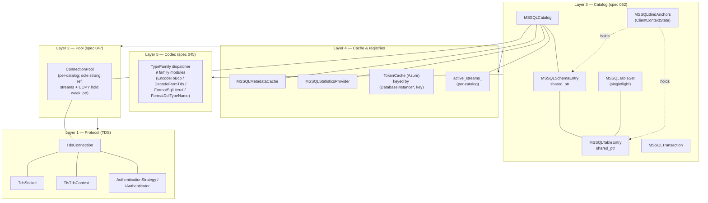

---

## Layer 1 — Protocol (TDS)

Custom TDS 7.4 implementation, no FreeTDS or ODBC. All protocol code lives under `src/tds/` in `namespace duckdb::tds`.

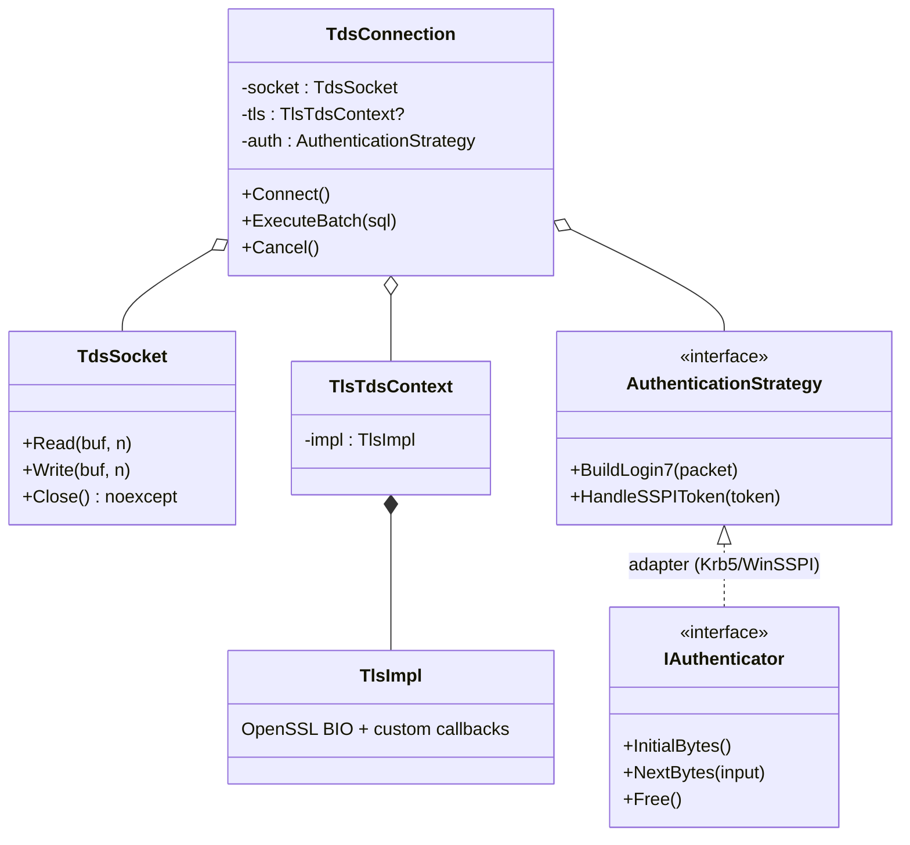

- `TdsConnection` owns the socket and (when `encrypt=true`) the TLS context. It exposes the packet-level operations the rest of the extension uses: PRELOGIN, LOGIN7, SQL_BATCH, ATTENTION.
- Auth strategies cover SQL auth, FEDAUTH (Azure AD), Kerberos (POSIX), and Windows SSPI. `IAuthenticator` is the SPNEGO continuation interface for integrated auth (spec 042).
- All destructors in this layer are `noexcept` (spec 047 T046k) — the teardown chain has no place to swallow errors except via `MSSQL_POOL_DEBUG_LOG`.

---

## Layer 2 — Connection pool (spec 047)

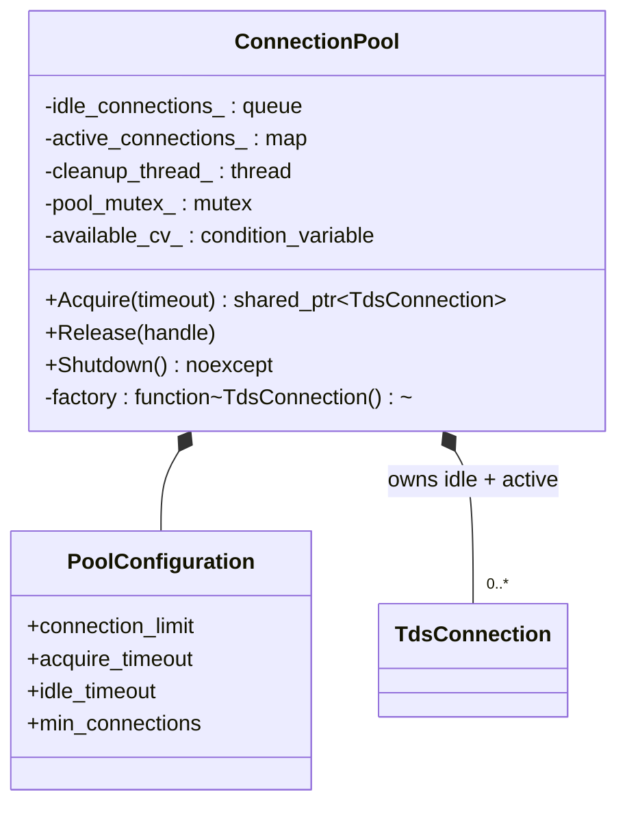

- One pool **per `MSSQLCatalog`** (no process-wide singleton — that was spec 047's headline fix). Lifetime is bounded by catalog lifetime.
- Background `cleanup_thread_` reaps idle connections past `idle_timeout`.
- DuckDB's quiescence contract requires every connection be released before `~MSSQLCatalog` runs; the pool's `Shutdown()` emits a warning + assertion if `active_connections_` is non-empty at teardown.
- **Destructor-time release contract (issues #178 / #179, extended by #191)**: two holders keep a connection past the client thread's control flow — `MSSQLResultStream` and `MSSQLCopyGlobalState` (BCP COPY). Both take a `weak_ptr` handle to the pool (`MSSQLCatalog::GetConnectionPoolHandle()`) rather than a reference to the catalog, and both must touch **no `ClientContext`** in their destructor: it can run on a worker thread while the client thread commits the query's transaction (TSan-confirmed race). Release targets — the pool `weak_ptr` and a `transaction_pinned` flag — are therefore captured on the **client thread** at construction (`MSSQLResultStream`'s ctor, `BCPCopyInitGlobal`). A failed `lock()` means the catalog is gone and degrades to dropping the connection, never a dangling dereference.
  - When `transaction_pinned`, the destructor only drops its reference: the `MSSQLTransaction` owns the pin and its own release path handles closing.
  - Otherwise a connection left in a non-`Idle` state is closed before `Release`, which discards it (`Release` only recycles `Idle` connections) — that discard is what decrements `active_connections_`. For COPY this is the path that ends a half-sent `INSERT BULK`, rolling back its transaction and dropping the target-table locks (#191).

---

## Layer 3 — Catalog (spec 052)

The big one. Concurrency safety here is the whole point of spec 052.

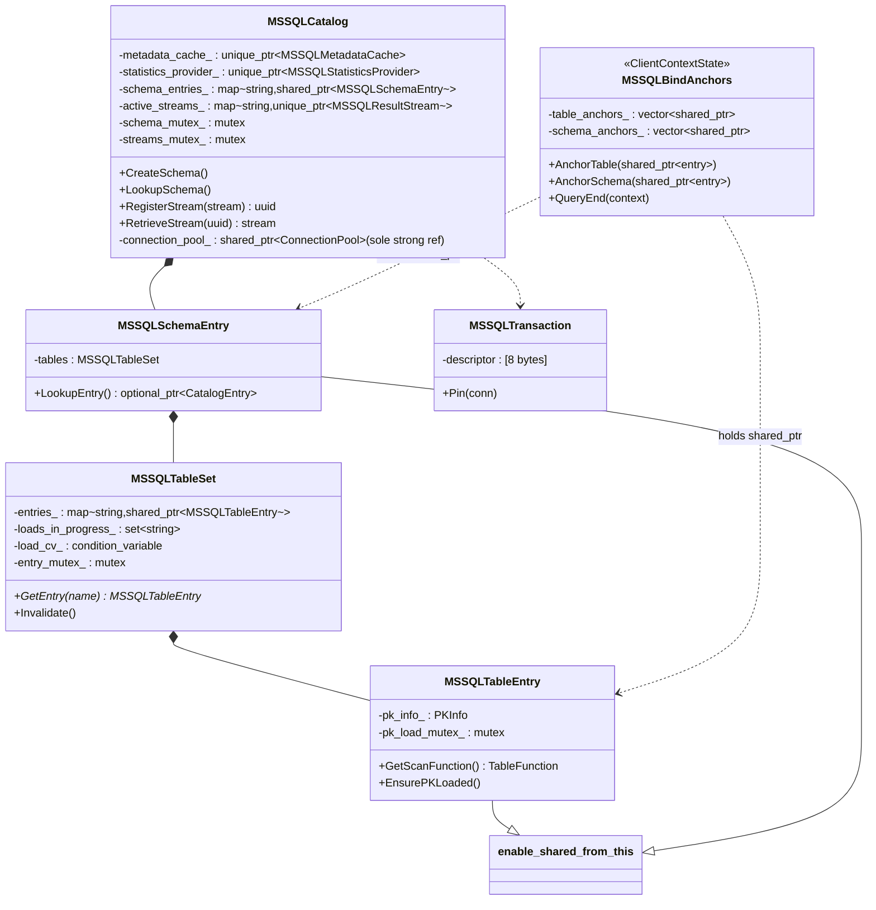

### Key invariants

- **shared_ptr ownership** for schema and table entries. Both inherit `enable_shared_from_this<>` so the catalog can hand out keep-alive references at `LookupEntry` time without copying the entry.
- **Singleflight load** in `MSSQLTableSet`: only one thread issues the SQL Server round trip per unloaded table; siblings wait on `load_cv_` and re-check `entries_` when notified. Emplace-only insertion guarantees the winner's entry wins; the losing thread's local `shared_ptr` is discarded harmlessly.
- **Bind anchors** are the lifetime mechanism. DuckDB's catalog API returns `optional_ptr<CatalogEntry>` (non-owning). Between `LookupEntry` returning that raw pointer and our extension code running, a concurrent `Invalidate()` could drop the entry. `MSSQLBindAnchors` stashes the `shared_ptr` into a per-ClientContext list at lookup time; DuckDB calls `QueryEnd()` after the query, dropping the anchors. While the query runs, the entry survives any concurrent invalidate.

### Singleflight first-load

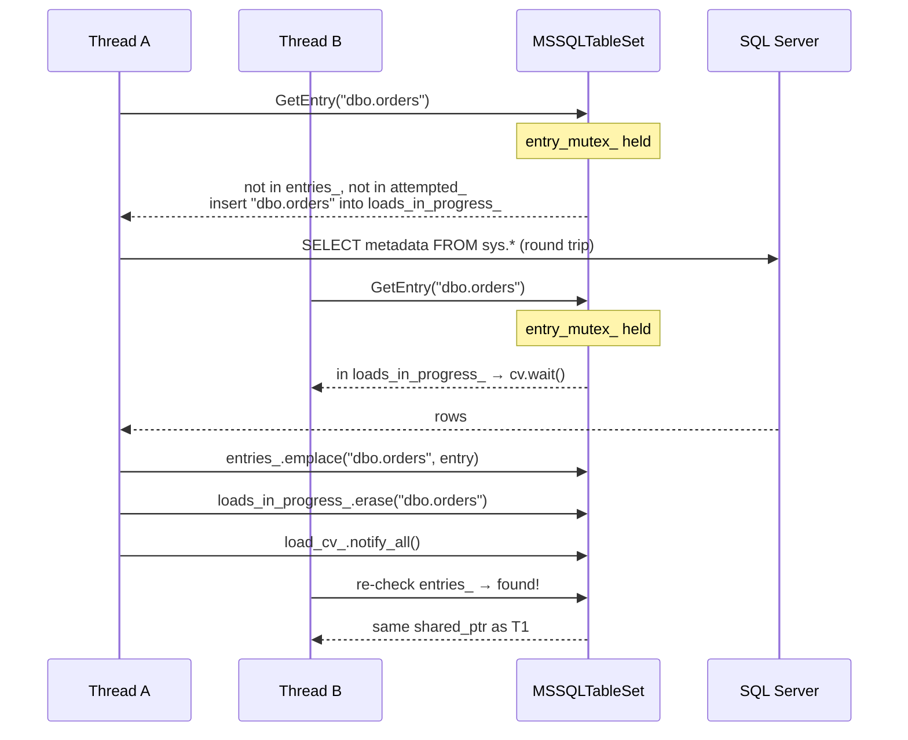

### Bind anchor lifecycle

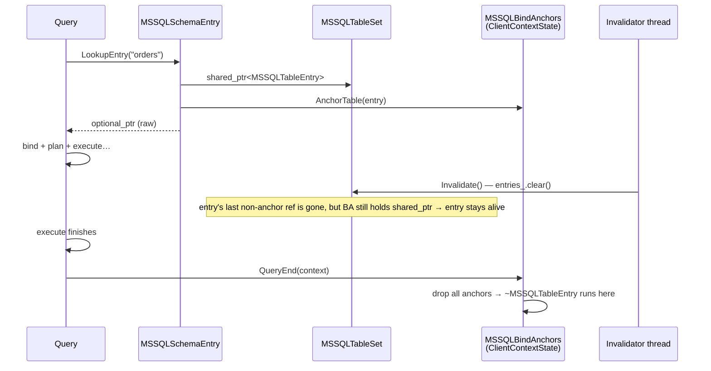

---

## Layer 4 — Cache & registries

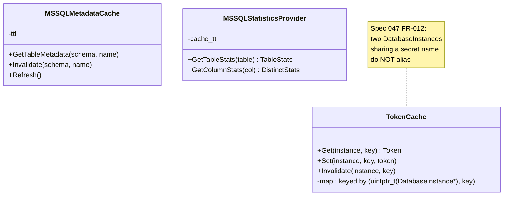

- `MSSQLMetadataCache` is incremental and lazy. `GetTableMetadata` **copies** the metadata out under the cache mutex — the previous raw-pointer return escaped the lock and raced `Refresh` / bulk reloads freeing the map node (issue #178 review finding).
- **Locking invariant (issue #178)**: ONE cache-wide `mutex_` guards `schemas_` and everything reachable through it (tables, columns, load states), plus `state_` / `database_collation_`. Loads hold it across their SQL round trip so partial state is never visible — concurrent metadata loads serialize by design. `ttl_seconds_` / `metadata_timeout_ms_` are atomics (written per-lookup by `EnsureCacheLoaded`, read by loaders mid-query while the mutex is held). The pre-#178 split (`mutex_` for Refresh/HasSchema, `schemas_mutex_` for everything else) let `Refresh()` free the whole map under a reader — TSan-confirmed UAF.
- `MSSQLStatisticsProvider` returns stats by value; no raw-pointer hand-out.
- `TokenCache` is the only remaining process-wide static, but it is **namespaced by `DatabaseInstance*`** (spec 047 FR-012) so two embeddings can use the same Azure secret name without aliasing.
- Result streams (large `mssql_scan` results) live in `MSSQLCatalog::active_streams_`, keyed by a UUID handle that bridges Bind-time stream creation and InitGlobal-time consumption (spec 047 US3).

### Cache invalidation

Existence and column metadata are cached in **two layers**, both filled lazily on first access:

1. **`MSSQLMetadataCache`** (this layer) — schema list, each schema's table/view list, and per-table column metadata.
2. **Schema table sets** (Layer 3 — `MSSQLTableSet` on each `MSSQLSchemaEntry`) — the bound `MSSQLTableEntry` objects DuckDB resolves names against; built from layer 1 the first time a table is read.

Both layers must be invalidated together. Invalidating only `MSSQLMetadataCache` is not enough once a table has been read: its bound `MSSQLTableEntry` survives in the schema's table set and would still satisfy a `CREATE TABLE IF NOT EXISTS`. `MSSQLCatalog::InvalidateMetadataCache()` does both (lazy — reload deferred to next access); `RefreshCache()` is the eager variant that reloads in one round-trip.

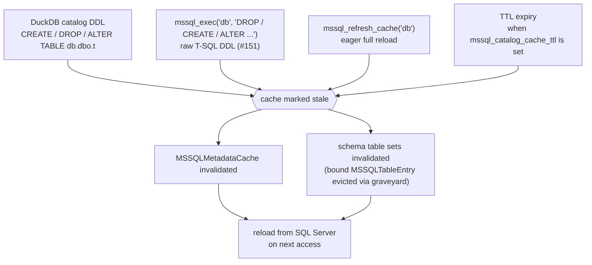

Statements run through `mssql_exec()` are plain T-SQL — DuckDB never sees them, so it cannot invalidate the cache on its own. Spec/issue **#151**: `mssql_exec()` detects DDL keywords (`CREATE`/`DROP`/`ALTER`/`TRUNCATE`/`RENAME`/`EXEC`) and calls `InvalidateMetadataCache()` after a successful run. `INSERT`/`UPDATE`/`DELETE` do not invalidate anything, so transaction-pinned DML through `mssql_exec()` is unaffected.

The auto-invalidation is gated by the `mssql_exec_invalidate_cache` setting, which **defaults to `false`** (matching the Postgres extension's `postgres_execute`): by default `mssql_exec()` does not touch the cache and the caller invalidates at a chosen granularity with `mssql_invalidate_cache(catalog [, schema [, table]])`. Set the flag `true` to auto-invalidate after `mssql_exec()` DDL.

| Granularity | Catalog call | Metadata cache | Table set |
|---|---|---|---|
| catalog | `InvalidateMetadataCache()` | all schemas + all columns | every schema's bound entries |
| schema | `InvalidateSchemaTableSet(schema)` | schema table list + that schema's columns | schema's bound entries |
| table | `InvalidateTableEntry(schema, table)` | that table's columns + `InvalidateSchemaTableList` (existence only) | `InvalidateEntry(table)` (one entry) |

Per-table is the cheap one: `InvalidateSchemaTableList` re-checks the table list (existence) **without** dropping any other table's column metadata, and `MSSQLTableSet::InvalidateEntry` evicts only the one bound entry — so a single `ALTER`/`DROP`/`CREATE` against a huge preloaded schema re-fetches just that table's columns, not the whole schema's.

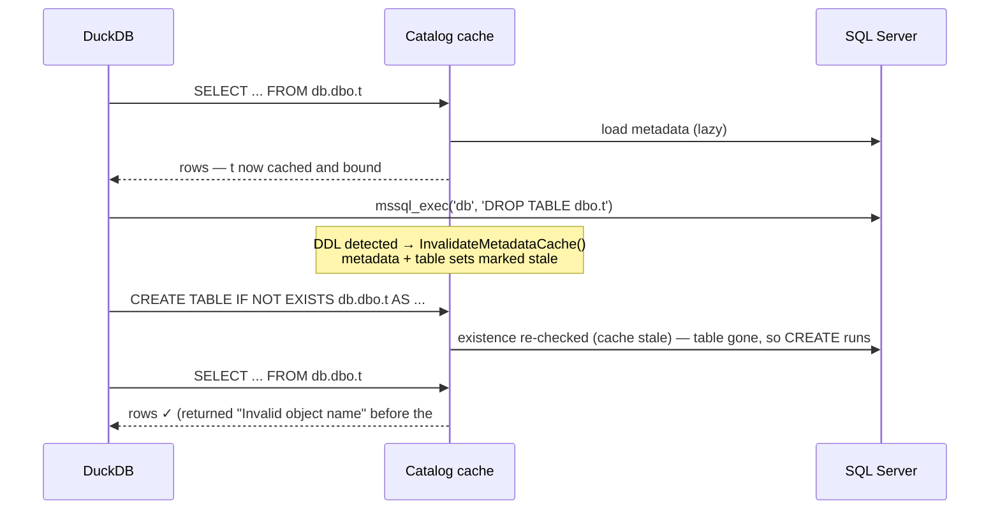

---

## Layer 5 — Codec (spec 045)

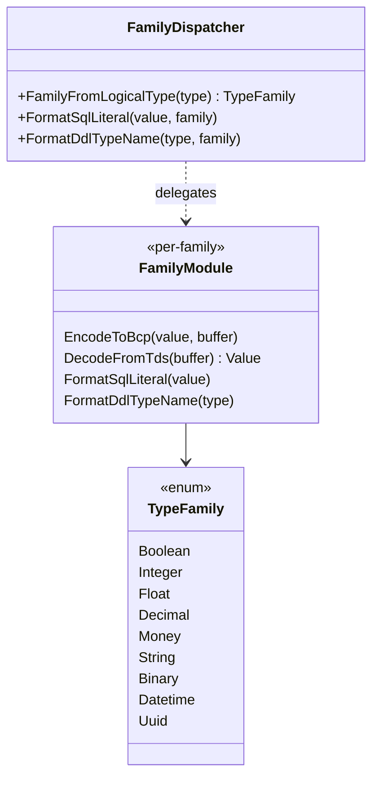

- One module per family under `src/codec/` (`boolean_codec.cpp`, `integer_codec.cpp`, etc.). Each owns its four operations (encode for BCP, decode from TDS, SQL literal formatting, DDL type-name rendering).
- The two dispatchers are `literal_format.cpp` and `type_family.cpp`. LogicalType-side dispatch sites in the rest of the codebase collapse to a one-liner family lookup.
- TIMESTAMP_MS/NS/S/TZ round-trip through SQL Server `DATETIME2(3/7/0/7)` with the catalog and the codec reporting the same DuckDB type — closes the VIEW catalog-vs-runtime divergence (issue #89).

---

## End-to-end: `SELECT … FROM mssql.dbo.t WHERE id = 1`

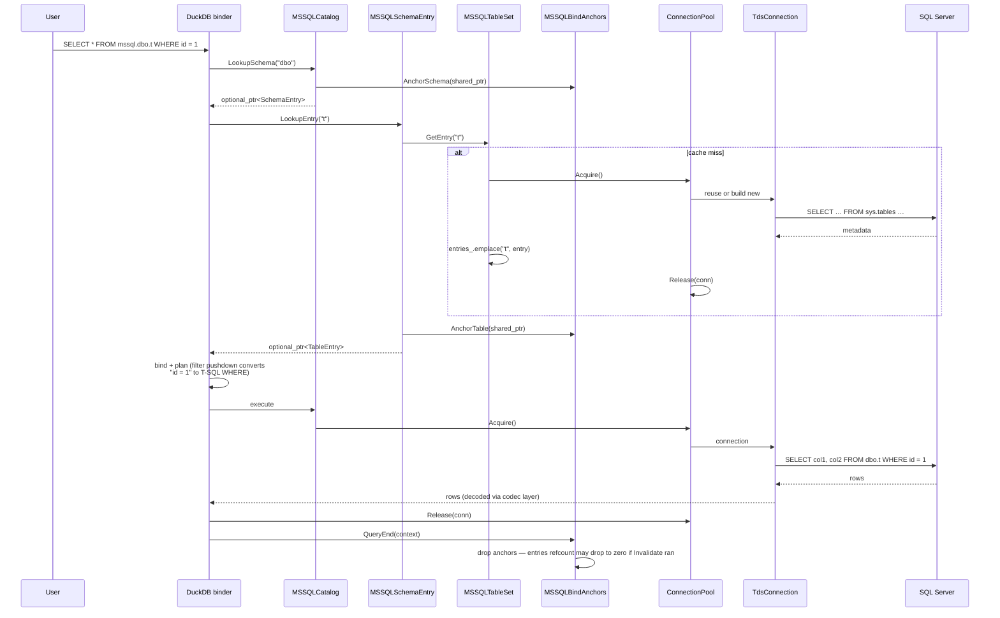

---

## Per-spec map

| Spec | What it added at the data-model level |
|---|---|
| 042 | `AuthenticationStrategy` / `IAuthenticator` (Kerberos/SSPI) in layer 1 |
| 045 | Family-dispatch codec layer 5 |
| 047 | Per-catalog `unique_ptr<ConnectionPool>` (was process-wide); per-catalog `active_streams_`; `TokenCache` keyed by `(DatabaseInstance*, key)` |
| 051 | `src/include/mssql_compat.hpp` — DuckDB API shims (header relocation, single-arg `BindScalarFunctionInput`) |
| 052 | `shared_ptr` ownership for schema/table entries + `enable_shared_from_this`; `MSSQLBindAnchors` per-ClientContext anchor holder; `MSSQLTableSet` singleflight loader; `MSSQLTableEntry::pk_load_mutex_` double-checked PK load |
| #178 | Single cache-wide mutex in `MSSQLMetadataCache` (was split across two, Refresh raced readers → UAF); atomic TTL/timeout config fields; `known_table_names_` consistently under `names_mutex_` (Scan was mutating it under `entry_mutex_`); thread-safe magic-static debug-level init everywhere |

## Where to read the code

- Catalog ownership: `src/include/catalog/mssql_catalog.hpp`, `src/catalog/mssql_catalog.cpp`
- Singleflight: `src/include/catalog/mssql_table_set.hpp`, `src/catalog/mssql_table_set.cpp`
- Bind anchors: `src/include/catalog/mssql_bind_anchors.hpp`, `src/catalog/mssql_bind_anchors.cpp`
- Pool: `src/include/tds/tds_connection_pool.hpp`, `src/tds/tds_connection_pool.cpp`
- TDS connection: `src/include/tds/tds_connection.hpp`, `src/tds/tds_connection.cpp`
- DuckDB API shims: `src/include/mssql_compat.hpp`
- Codec dispatch: `src/codec/type_family.cpp`, `src/codec/literal_format.cpp`
