# Data model

How the extension is structured inside the process. Five layers, each owned by the one above it, with the DuckDB `DatabaseInstance` at the top and a TCP socket at the bottom.

Layers 1–5 describe **reading**. The write path (`COPY … TO`, `CREATE TABLE … AS SELECT`) reuses layers 1, 2 and 5 but owns connections and threads differently enough to need [its own section](#the-write-path-spec-057) — read that before changing anything in it, because the read-path picture is actively misleading about connection ownership there.

## Primer (user perspective)

Each `ATTACH '…' AS db (TYPE mssql)` creates exactly one `MSSQLCatalog` inside DuckDB. That catalog owns **everything** related to that connection: its own connection pool, its own metadata cache, its own statistics, its own per-catalog result-stream registry. Two ATTACHes against the same DSN under different aliases get fully independent state — there is no process-wide singleton. `DETACH` runs `~MSSQLCatalog` deterministically via RAII and tears the whole stack down.

Connections inside the pool are reused across queries; the pool factory builds a fresh `TdsConnection` (with TLS, integrated auth, FEDAUTH token, or SQL auth as configured) on each miss. Metadata is loaded lazily, then cached; a per-table **singleflight** coordinates concurrent first-loads so one round trip serves all waiting binders. Bind data holds **anchors** (shared_ptr) to the catalog entries it touched; they release at `QueryEnd`, so a concurrent `mssql_refresh_cache` can't pull an entry out from under an executing query.

## Architecture stack

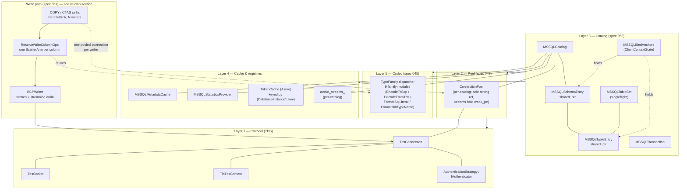
```mermaid
flowchart TD
    subgraph L5["Layer 5 — Codec (spec 045)"]
        codec["TypeFamily dispatcher<br/>9 family modules<br/>(EncodeToBcp / DecodeFromTds /<br/>FormatSqlLiteral / FormatDdlTypeName)"]
    end
    subgraph L4["Layer 4 — Cache & registries"]
        meta[MSSQLMetadataCache]
        stats[MSSQLStatisticsProvider]
        token["TokenCache (Azure)<br/>keyed by (DatabaseInstance*, key)"]
        streams["active_streams_<br/>(per-catalog)"]
    end
    subgraph L3["Layer 3 — Catalog (spec 052)"]
        cat[MSSQLCatalog]
        sch["MSSQLSchemaEntry<br/>shared_ptr"]
        tbl["MSSQLTableEntry<br/>shared_ptr"]
        tset["MSSQLTableSet<br/>(singleflight)"]
        anchors["MSSQLBindAnchors<br/>(ClientContextState)"]
        tx[MSSQLTransaction]
    end
    subgraph L2["Layer 2 — Pool (spec 047)"]
        pool["ConnectionPool<br/>(per-catalog; sole strong ref,<br/>streams hold weak_ptr)"]
    end
    subgraph L1["Layer 1 — Protocol (TDS)"]
        conn[TdsConnection]
        sock[TdsSocket]
        tls[TlsTdsContext]
        auth["AuthenticationStrategy /<br/>IAuthenticator"]
    end
    subgraph LW["Write path (spec 057) — see its own section"]
        sinks["COPY / CTAS sinks<br/>ParallelSink, N writers"]
        ops["ResolveWriteColumnOps<br/>one ScatterArm per column"]
        bcp["BCPWriter<br/>frames + streaming drain"]
    end
    L3 --> L4
    L3 --> L2
    L3 --> L5
    L2 --> L1
    sinks --> ops
    ops --> bcp
    ops -.reuses.-> codec
    sinks -.one pooled connection<br/>per writer.-> pool
    bcp --> conn
    cat --- pool
    cat --- meta
    cat --- stats
    cat --- streams
    cat --- sch
    sch --- tbl
    tset --- tbl
    anchors -.holds.-> tbl
    anchors -.holds.-> sch
    pool --- conn
    conn --- sock
    conn --- tls
    conn --- auth
```

---

## Layer 1 — Protocol (TDS)

Custom TDS 7.4 implementation, no FreeTDS or ODBC. All protocol code lives under `src/tds/` in `namespace duckdb::tds`.

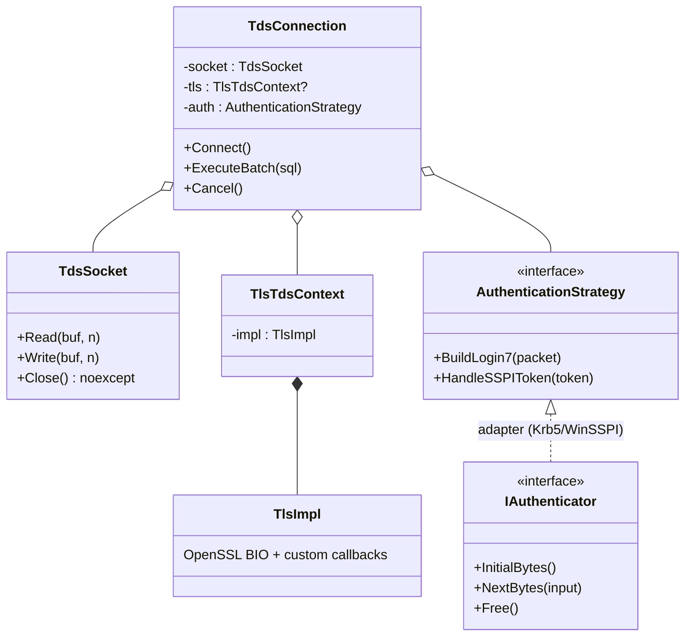
```mermaid
classDiagram
    class TdsConnection {
        +Connect()
        +ExecuteBatch(sql)
        +Cancel()
        -socket : TdsSocket
        -tls : TlsTdsContext?
        -auth : AuthenticationStrategy
    }
    class TdsSocket {
        +Read(buf, n)
        +Write(buf, n)
        +Close() noexcept
    }
    class TlsTdsContext {
        -impl : TlsImpl
    }
    class TlsImpl {
        OpenSSL BIO + custom callbacks
    }
    class AuthenticationStrategy {
        <<interface>>
        +BuildLogin7(packet)
        +HandleSSPIToken(token)
    }
    class IAuthenticator {
        <<interface>>
        +InitialBytes()
        +NextBytes(input)
        +Free()
    }
    TdsConnection o-- TdsSocket
    TdsConnection o-- TlsTdsContext
    TdsConnection o-- AuthenticationStrategy
    TlsTdsContext *-- TlsImpl
    AuthenticationStrategy <|.. IAuthenticator : adapter (Krb5/WinSSPI)
```

- `TdsConnection` owns the socket and (when `encrypt=true`) the TLS context. It exposes the packet-level operations the rest of the extension uses: PRELOGIN, LOGIN7, SQL_BATCH, ATTENTION.
- Auth strategies cover SQL auth, FEDAUTH (Azure AD), Kerberos (POSIX), and Windows SSPI. `IAuthenticator` is the SPNEGO continuation interface for integrated auth (spec 042).
- All destructors in this layer are `noexcept` (spec 047 T046k) — the teardown chain has no place to swallow errors except via `MSSQL_POOL_DEBUG_LOG`.

### Login is a loop, not a step (spec 068)

A login is not one handshake against one host. Any of these endpoints may answer
LOGIN7 with a ROUTING ENVCHANGE (type 20) meaning "not here, log in over there":
Azure SQL Managed Instance, Azure SQL under the Redirect connection policy
(the default from inside Azure), Fabric/Synapse gateways, on-prem AlwaysOn
read-only routing. So the connection's login step is:

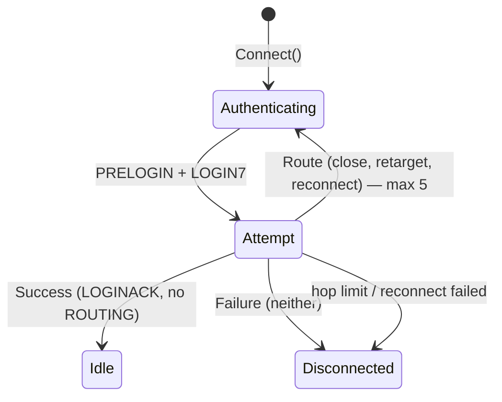
```mermaid
stateDiagram-v2
    [*] --> Authenticating: Connect()
    Authenticating --> Attempt: PRELOGIN + LOGIN7
    Attempt --> Idle: Success (LOGINACK, no ROUTING)
    Attempt --> Authenticating: Route (close, retarget, reconnect) — max 5
    Attempt --> Disconnected: Failure (neither)
    Attempt --> Disconnected: hop limit / reconnect failed
```

Invariants that make this safe, all owned by `TdsConnection::RunWithRoutingHops`
and none by the callbacks:

- **ROUTING outranks LOGINACK.** A routed response is a hop even when a LOGINACK
  came with it — [MS-TDS] says a routed session is unusable. The per-attempt
  callback therefore returns `LoginAttemptOutcome::{Success, Route, Failure}`; a
  bool cannot express the routed-without-LOGINACK case, and mis-expressing it is
  the bug spec 068 fixed.
- **The state machine stays in `Authenticating` across a hop.** The loop calls
  `socket_->Connect()`, not `TdsConnection::Connect()`, and no callback touches
  `state_` or closes the socket.
- **Per-hop reset**: packet id → 1, TLS off, FEDAUTH echo off, routing fields
  cleared (also *before* the first attempt, so a reused connection cannot
  inherit a stale route). `tds_server_name_` is deliberately kept — it is the
  hop's output, and carries the `hostname\instance` form into LOGIN7.
- **Bounded**: 5 hops, then an error naming the count and the last routed target.
- **Credential per target**: `AuthenticateIntegrated` takes an
  `AuthenticatorFactory` rather than an authenticator, because a Kerberos/SSPI
  ticket is bound to the target's SPN; each hop builds a new one for the routed
  host and frees the previous context first.

---

## Layer 2 — Connection pool (spec 047)

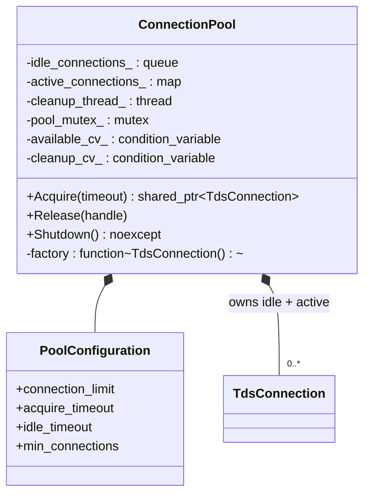
```mermaid
classDiagram
    class ConnectionPool {
        +Acquire(timeout) shared_ptr~TdsConnection~
        +Release(handle)
        +Shutdown() noexcept
        -factory : function~TdsConnection()~
        -idle_connections_ : queue
        -active_connections_ : map
        -cleanup_thread_ : thread
        -pool_mutex_ : mutex
        -available_cv_ : condition_variable
        -cleanup_cv_ : condition_variable
    }
    class PoolConfiguration {
        +connection_limit
        +acquire_timeout
        +idle_timeout
        +min_connections
    }
    ConnectionPool *-- PoolConfiguration
    ConnectionPool *-- "0..*" TdsConnection : owns idle + active
```

- One pool **per `MSSQLCatalog`** (no process-wide singleton — that was spec 047's headline fix). Lifetime is bounded by catalog lifetime.
- Background `cleanup_thread_` reaps idle connections past `idle_timeout`. It parks on its **own** `cleanup_cv_` (notified only by `Shutdown()`, so DETACH doesn't wait out a blind 1-second sleep); `available_cv_` is reserved for `Acquire()` waiters — the invariant is that `Release()`'s `notify_one` always reaches a thread blocked on pool exhaustion, never the cleanup thread (spec 054 review).
- DuckDB's quiescence contract requires every connection be released before `~MSSQLCatalog` runs; the pool's `Shutdown()` emits a warning + assertion if `active_connections_` is non-empty at teardown.
- COPY/CTAS bulk loads that die mid-BCP-stream must not return the connection as-is (the server still awaits bulk data). Both paths share one release protocol — `mssql::ReleaseBcpConnectionOnError` (`src/connection/mssql_connection_provider.cpp`): close if mid-stream, then `SetNeedsReset` + `Release` through the catalog's `weak_ptr` pool handle (a failed `lock()` = catalog torn down → drop). Worker-thread safe (issue #178); called from `~MSSQLCopyGlobalState` (issue #191), `CTASExecutionState::ReleaseBCPConnectionOnError` and `BulkLoadSession`.

### Session reset, and who decides it (issue #189)

A connection going back to the pool is flagged for **session reset** — the TDS
`RESET_CONNECTION` header bit, what `sp_reset_connection` does. That is why a
`##global` temp table does not survive between statements: it lives exactly as
long as the session that created it, and the reset ends that session on the same
physical connection (`@@SPID` unchanged).

There is no selective form to ask for instead — one bit, two variants, and
`RESET_CONNECTION_SKIP_TRAN` drops `##g` and a local `#loc` identically. So
`mssql_reset_connection = false` turns it off wholesale, and what the user takes
on is not "temp tables" but **all** session state: `SET` options, isolation level,
session variables, `CONTEXT_INFO`, cursors — and an open transaction that then
keeps its locks until that connection is used again.

Four release paths honour it, and each learns the answer on the CLIENT thread
because none of them can ask a `ClientContext` where they run:

| path | how it knows |
|---|---|
| autocommit release (`ConnectionProvider::ReleaseConnection` — what `mssql_exec` uses) | read per release, so `SET` applies to the next statement |
| result-stream close (**every** `mssql_scan` and table scan) | captured at construction (issue #178: the destructor may be on a worker thread) |
| COMMIT / ROLLBACK | captured at BEGIN — `TransactionManager::RollbackTransaction` receives no `ClientContext`, and a rule holding on COMMIT but not ROLLBACK would be worse than either answer |
| `ReleaseBcpConnectionOnError` | passed in by the caller; the parameter has **no default**, so a new caller cannot silently skip the question |

The prerequisite is on the write side: with the reset off, a `#temp` COPY outside
a transaction becomes meaningful and therefore unpinned, and without the target
predicate above it would open N writers against N pooled sessions — some holding
a **stale same-named** temp table, whose writes succeed against the wrong one
silently.

---

## Layer 3 — Catalog (spec 052)

The big one. Concurrency safety here is the whole point of spec 052.

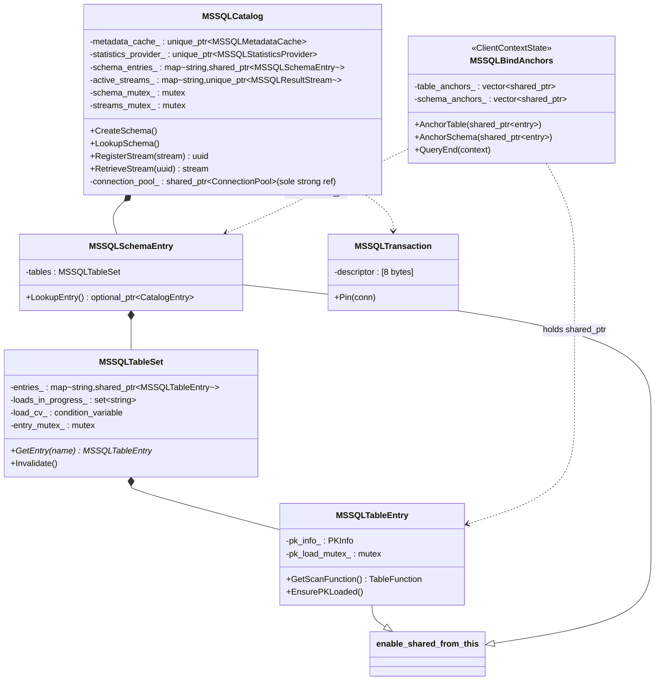
```mermaid
classDiagram
    class MSSQLCatalog {
        +CreateSchema()
        +LookupSchema()
        +RegisterStream(stream) uuid
        +RetrieveStream(uuid) stream
        -connection_pool_ : shared_ptr~ConnectionPool~ (sole strong ref)
        -metadata_cache_ : unique_ptr~MSSQLMetadataCache~
        -statistics_provider_ : unique_ptr~MSSQLStatisticsProvider~
        -schema_entries_ : map~string,shared_ptr~MSSQLSchemaEntry~~
        -active_streams_ : map~string,unique_ptr~MSSQLResultStream~~
        -schema_mutex_ : mutex
        -streams_mutex_ : mutex
    }
    class MSSQLSchemaEntry {
        +LookupEntry() optional_ptr~CatalogEntry~
        -tables : MSSQLTableSet
    }
    class MSSQLTableSet {
        +GetEntry(name) MSSQLTableEntry*
        +Invalidate()
        -entries_ : map~string,shared_ptr~MSSQLTableEntry~~
        -loads_in_progress_ : set~string~
        -load_cv_ : condition_variable
        -entry_mutex_ : mutex
    }
    class MSSQLTableEntry {
        +GetScanFunction() TableFunction
        +EnsurePKLoaded()
        -pk_info_ : PKInfo
        -pk_load_mutex_ : mutex
    }
    class MSSQLBindAnchors {
        <<ClientContextState>>
        +AnchorTable(shared_ptr~entry~)
        +AnchorSchema(shared_ptr~entry~)
        +QueryEnd(context)
        -table_anchors_ : vector~shared_ptr~
        -schema_anchors_ : vector~shared_ptr~
    }
    class MSSQLTransaction {
        +Pin(conn)
        -descriptor : [8 bytes]
    }
    MSSQLCatalog *-- MSSQLSchemaEntry
    MSSQLSchemaEntry *-- MSSQLTableSet
    MSSQLTableSet *-- MSSQLTableEntry
    MSSQLBindAnchors ..> MSSQLTableEntry : holds shared_ptr
    MSSQLBindAnchors ..> MSSQLSchemaEntry : holds shared_ptr
    MSSQLCatalog ..> MSSQLTransaction
    MSSQLTableEntry --|> enable_shared_from_this
    MSSQLSchemaEntry --|> enable_shared_from_this
```

### Key invariants

- **shared_ptr ownership** for schema and table entries. Both inherit `enable_shared_from_this<>` so the catalog can hand out keep-alive references at `LookupEntry` time without copying the entry.
- **Singleflight load** in `MSSQLTableSet`: only one thread issues the SQL Server round trip per unloaded table; siblings wait on `load_cv_` and re-check `entries_` when notified. Emplace-only insertion guarantees the winner's entry wins; the losing thread's local `shared_ptr` is discarded harmlessly.
- **Bind anchors** are the lifetime mechanism. DuckDB's catalog API returns `optional_ptr<CatalogEntry>` (non-owning). Between `LookupEntry` returning that raw pointer and our extension code running, a concurrent `Invalidate()` could drop the entry. `MSSQLBindAnchors` stashes the `shared_ptr` into a per-ClientContext list at lookup time; DuckDB calls `QueryEnd()` after the query, dropping the anchors. While the query runs, the entry survives any concurrent invalidate.

### Singleflight first-load

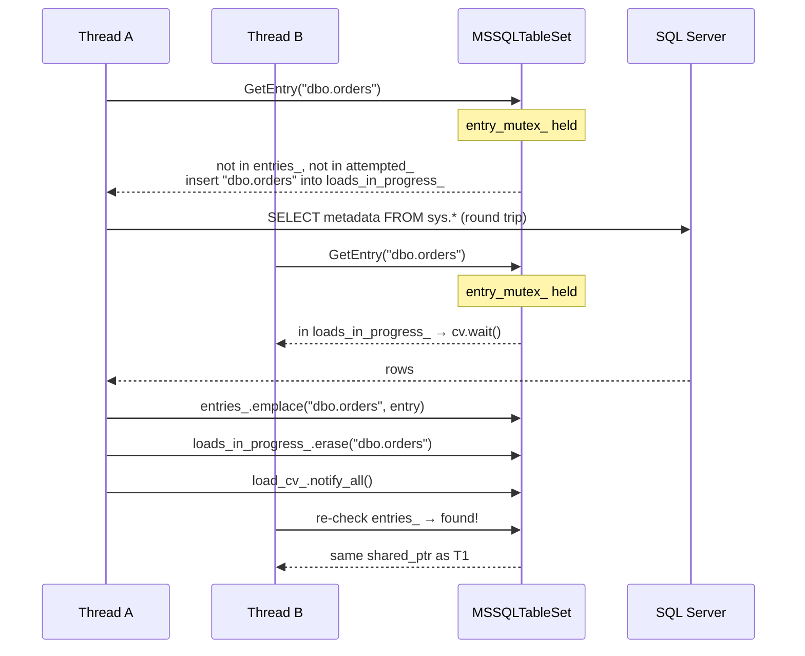
```mermaid
sequenceDiagram
    participant T1 as Thread A
    participant T2 as Thread B
    participant TS as MSSQLTableSet
    participant SQL as SQL Server

    T1->>TS: GetEntry("dbo.orders")
    Note over TS: entry_mutex_ held
    TS-->>T1: not in entries_, not in attempted_<br/>insert "dbo.orders" into loads_in_progress_
    T1->>SQL: SELECT metadata FROM sys.* (round trip)
    T2->>TS: GetEntry("dbo.orders")
    Note over TS: entry_mutex_ held
    TS-->>T2: in loads_in_progress_ → cv.wait()
    SQL-->>T1: rows
    T1->>TS: entries_.emplace("dbo.orders", entry)
    T1->>TS: loads_in_progress_.erase("dbo.orders")
    T1->>TS: load_cv_.notify_all()
    T2->>TS: re-check entries_ → found!
    TS-->>T2: same shared_ptr as T1
```

### Bind anchor lifecycle

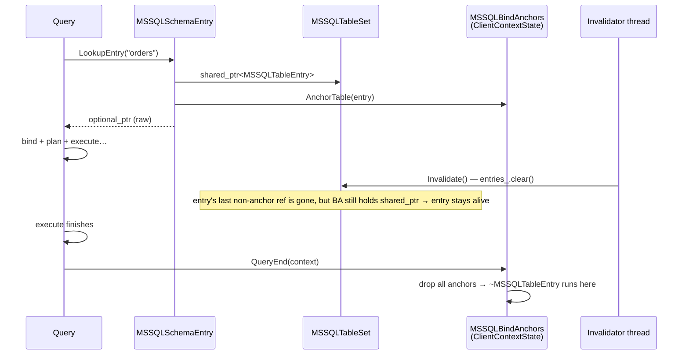
```mermaid
sequenceDiagram
    participant Q as Query
    participant SE as MSSQLSchemaEntry
    participant TS as MSSQLTableSet
    participant BA as MSSQLBindAnchors<br/>(ClientContextState)
    participant Inv as Invalidator thread

    Q->>SE: LookupEntry("orders")
    SE->>TS: shared_ptr<MSSQLTableEntry>
    SE->>BA: AnchorTable(entry)
    SE-->>Q: optional_ptr (raw)
    Q->>Q: bind + plan + execute…
    Inv->>TS: Invalidate() — entries_.clear()
    Note over TS: entry's last non-anchor ref is gone, but BA still holds shared_ptr → entry stays alive
    Q->>Q: execute finishes
    Q->>BA: QueryEnd(context)
    BA->>BA: drop all anchors → ~MSSQLTableEntry runs here
```

---

## Layer 4 — Cache & registries

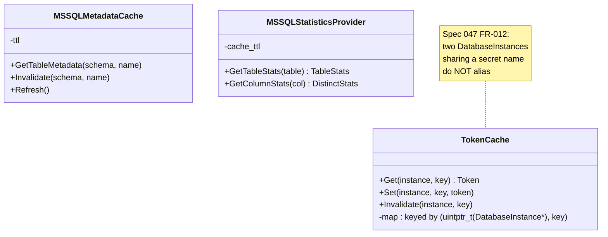
```mermaid
classDiagram
    class MSSQLMetadataCache {
        +GetTableMetadata(schema, name)
        +Invalidate(schema, name)
        +Refresh()
        -ttl
    }
    class MSSQLStatisticsProvider {
        +GetTableStats(table) TableStats
        +GetColumnStats(col) DistinctStats
        -cache_ttl
    }
    class TokenCache {
        +Get(instance, key) Token
        +Set(instance, key, token)
        +Invalidate(instance, key)
        -map : keyed by (uintptr_t(DatabaseInstance*), key)
    }
    note for TokenCache "Spec 047 FR-012:<br/>two DatabaseInstances<br/>sharing a secret name<br/>do NOT alias"
```

- `MSSQLMetadataCache` is incremental and lazy. `GetTableMetadata` **copies** the metadata out under the cache mutex — the previous raw-pointer return escaped the lock and raced `Refresh` / bulk reloads freeing the map node (issue #178 review finding).
- **Locking invariant (issue #178)**: ONE cache-wide `mutex_` guards `schemas_` and everything reachable through it (tables, columns, load states), plus `state_` / `database_collation_`. Loads hold it across their SQL round trip so partial state is never visible — concurrent metadata loads serialize by design. `ttl_seconds_` / `metadata_timeout_ms_` are atomics (written per-lookup by `EnsureCacheLoaded`, read by loaders mid-query while the mutex is held). The pre-#178 split (`mutex_` for Refresh/HasSchema, `schemas_mutex_` for everything else) let `Refresh()` free the whole map under a reader — TSan-confirmed UAF.
- `MSSQLStatisticsProvider` returns stats by value; no raw-pointer hand-out.
- `TokenCache` is the only remaining process-wide static, but it is **namespaced by `DatabaseInstance*`** (spec 047 FR-012) so two embeddings can use the same Azure secret name without aliasing.
- Result streams (large `mssql_scan` results) live in `MSSQLCatalog::active_streams_`, keyed by a UUID handle that bridges Bind-time stream creation and InitGlobal-time consumption (spec 047 US3).

### Cache invalidation

Existence and column metadata are cached in **two layers**, both filled lazily on first access:

1. **`MSSQLMetadataCache`** (this layer) — schema list, each schema's table/view list, and per-table column metadata.
2. **Schema table sets** (Layer 3 — `MSSQLTableSet` on each `MSSQLSchemaEntry`) — the bound `MSSQLTableEntry` objects DuckDB resolves names against; built from layer 1 the first time a table is read.

Both layers must be invalidated together. Invalidating only `MSSQLMetadataCache` is not enough once a table has been read: its bound `MSSQLTableEntry` survives in the schema's table set and would still satisfy a `CREATE TABLE IF NOT EXISTS`. `MSSQLCatalog::InvalidateMetadataCache()` does both (lazy — reload deferred to next access); `RefreshCache()` is the eager variant that reloads in one round-trip.

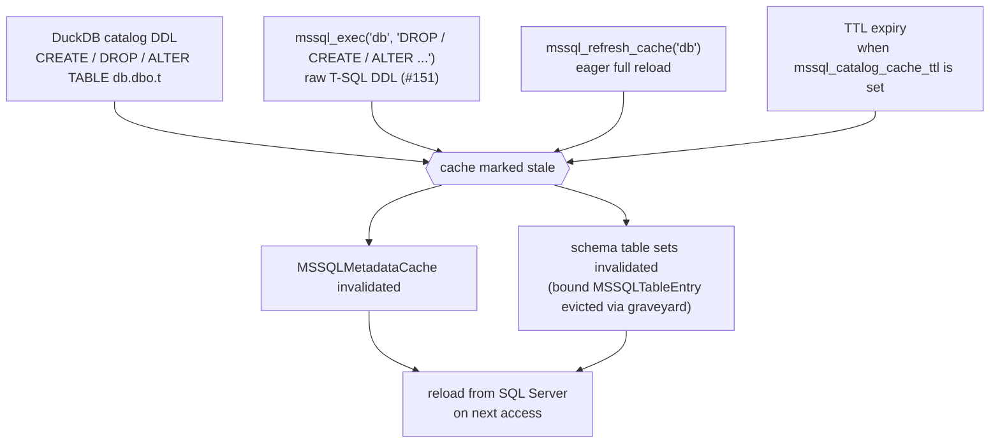
```mermaid
flowchart TD
    A["DuckDB catalog DDL<br/>CREATE / DROP / ALTER TABLE db.dbo.t"] --> X{{"cache marked stale"}}
    B["mssql_exec('db', 'DROP / CREATE / ALTER ...')<br/>raw T-SQL DDL (#151)"] --> X
    C["mssql_refresh_cache('db')<br/>eager full reload"] --> X
    D["TTL expiry<br/>when mssql_catalog_cache_ttl is set"] --> X
    X --> MC["MSSQLMetadataCache invalidated"]
    X --> TS["schema table sets invalidated<br/>(bound MSSQLTableEntry evicted via graveyard)"]
    MC --> N["reload from SQL Server<br/>on next access"]
    TS --> N
```

Statements run through `mssql_exec()` are plain T-SQL — DuckDB never sees them, so it cannot invalidate the cache on its own. Spec/issue **#151**: `mssql_exec()` detects DDL keywords (`CREATE`/`DROP`/`ALTER`/`TRUNCATE`/`RENAME`/`EXEC`) and calls `InvalidateMetadataCache()` after a successful run. `INSERT`/`UPDATE`/`DELETE` do not invalidate anything, so transaction-pinned DML through `mssql_exec()` is unaffected.

The auto-invalidation is gated by the `mssql_exec_invalidate_cache` setting, which **defaults to `false`** (matching the Postgres extension's `postgres_execute`): by default `mssql_exec()` does not touch the cache and the caller invalidates at a chosen granularity with `mssql_invalidate_cache(catalog [, schema [, table]])`. Set the flag `true` to auto-invalidate after `mssql_exec()` DDL.

| Granularity | Catalog call | Metadata cache | Table set |
|---|---|---|---|
| catalog | `InvalidateMetadataCache()` | all schemas + all columns | every schema's bound entries |
| schema | `InvalidateSchemaTableSet(schema)` | schema table list + that schema's columns | schema's bound entries |
| table | `InvalidateTableEntry(schema, table)` | that table's columns + `InvalidateSchemaTableList` (existence only) | `InvalidateEntry(table)` (one entry) |

Per-table is the cheap one: `InvalidateSchemaTableList` re-checks the table list (existence) **without** dropping any other table's column metadata, and `MSSQLTableSet::InvalidateEntry` evicts only the one bound entry — so a single `ALTER`/`DROP`/`CREATE` against a huge preloaded schema re-fetches just that table's columns, not the whole schema's.

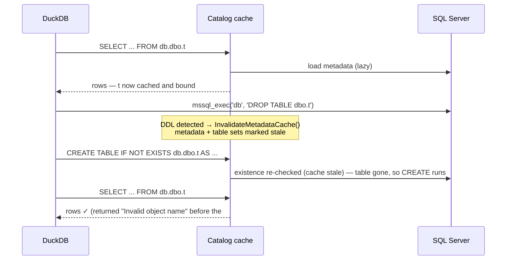
```mermaid
sequenceDiagram
    participant U as DuckDB
    participant C as Catalog cache
    participant S as SQL Server
    U->>C: SELECT ... FROM db.dbo.t
    C->>S: load metadata (lazy)
    C-->>U: rows — t now cached and bound
    U->>S: mssql_exec('db', 'DROP TABLE dbo.t')
    Note over C: DDL detected → InvalidateMetadataCache()<br/>metadata + table sets marked stale
    U->>C: CREATE TABLE IF NOT EXISTS db.dbo.t AS ...
    C->>S: existence re-checked (cache stale) — table gone, so CREATE runs
    U->>C: SELECT ... FROM db.dbo.t
    C-->>U: rows ✓ (returned "Invalid object name" before the #151 fix)
```

---

## Layer 5 — Codec (spec 045)

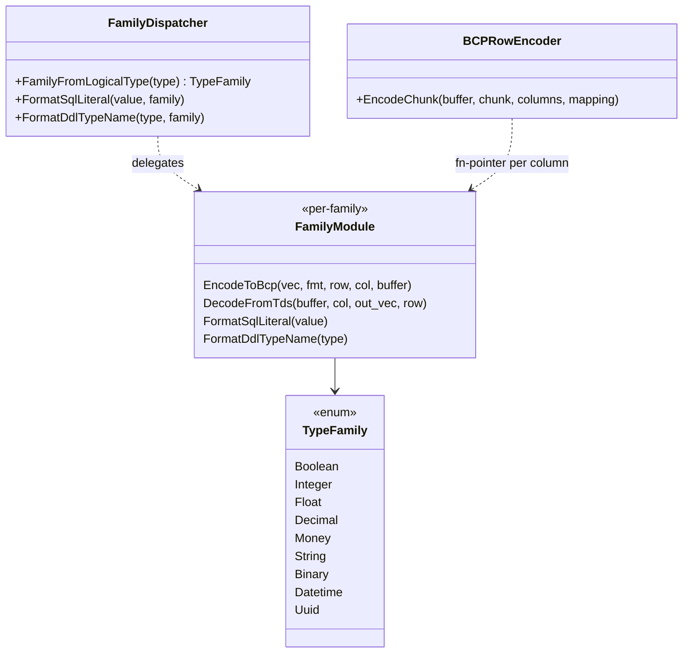
```mermaid
classDiagram
    class TypeFamily {
        <<enum>>
        Boolean
        Integer
        Float
        Decimal
        Money
        String
        Binary
        Datetime
        Uuid
    }
    class FamilyDispatcher {
        +FamilyFromLogicalType(type) TypeFamily
        +FormatSqlLiteral(value, family)
        +FormatDdlTypeName(type, family)
    }
    class FamilyModule {
        <<per-family>>
        EncodeToBcp(vec, fmt, row, col, buffer)
        DecodeFromTds(buffer, col, out_vec, row)
        FormatSqlLiteral(value)
        FormatDdlTypeName(type)
    }
    class BCPRowEncoder {
        +EncodeChunk(buffer, chunk, columns, mapping)
    }
    FamilyDispatcher ..> FamilyModule : delegates
    FamilyModule --> TypeFamily
    BCPRowEncoder ..> FamilyModule : fn-pointer per column
```

- One module per family under `src/codec/` (`boolean_codec.cpp`, `integer_codec.cpp`, etc.). Each owns its four operations (encode for BCP, decode from TDS, SQL literal formatting, DDL type-name rendering).
- The two dispatchers are `literal_format.cpp` and `type_family.cpp`. LogicalType-side dispatch sites in the rest of the codebase collapse to a one-liner family lookup. `type_family.hpp` also owns `TYPE_FAMILY_COUNT` and `FamilyName()` — anything sized or labelled per family (the `MSSQL_DEBUG>=2` counter output) uses these, never a hand-sized `[9]` table.
- **BCP encode contract (spec 054 W1/W2)**: production writes go through `BCPRowEncoder::EncodeChunk`, which builds one `UnifiedVectorFormat` per column per chunk, resolves each column's family encoder ONCE to a function pointer, precomputes the NULL wire kind (fixed / variable-USHORT / PLP), and emits the `0xD1` ROW token per row. Family `EncodeToBcp` overloads take the pre-built format (`vec, fmt, row, col, buffer`); shared accessors (`FormatValue` / `FormatIsNull`) and the per-row test shim (`EncodeToBcpViaFormat`) live in `codec/vector_format.hpp`. A new family or encode caller must implement/consume the fmt overload — the per-row `(Vector&, idx_t)` wrapper is a unit-test compatibility API only.
- **TDS decode (spec 054 R1)**: `DecodeFromTds` writes straight into the output `Vector` slot (`StringVector::EmptyString` + valid-input UTF-16→UTF-8 conversion, no intermediate `std::string`); invalid UTF-16 (unpaired surrogates — legal UCS-2) falls back to the legacy decoder on the untrimmed payload with output-side CHAR/NCHAR space trim, preserving pre-054 semantics exactly.
- TIMESTAMP_MS/NS/S/TZ round-trip through SQL Server `DATETIME2(3/7/0/7)` with the catalog and the codec reporting the same DuckDB type — closes the VIEW catalog-vs-runtime divergence (issue #89).
- **Target string types (spec 060)**: `codec/target_string_type.{hpp,cpp}` carries a string column's *stated* SQL Server type — `{unicode, length, collation}` — on the `LogicalType` itself, as an alias (`MSSQL_VARCHAR` / `MSSQL_NVARCHAR`) plus `ExtensionTypeInfo`. Written by the type binder, by the catalog for attached columns, and by `ApplyDefaultStringType` for the session default. Read by everything that has to name a type: both DDL translators, the `INSERT BULK` column list, and the encoder's length bound.
  - The physical type stays `VARCHAR`, so no codec, staging or BCP arm changes shape. What the annotation buys is that four sites read one answer instead of deciding separately — the failure it prevents is a feature that works on COPY and silently not on CTAS.
  - **The bound is not a DuckDB constraint.** Nothing truncates or rejects on the DuckDB side; the length is enforced at the write boundary and by the server.
  - **Two collations, not one.** The DDL collation may be empty, meaning "inherit the database's" — correct and cheap. The WIRE collation (`MSSQLCatalog::WireVarcharCollation`) may not: the server reads an `INSERT BULK` payload by the collation named in the statement text, and inherits nothing. A UTF-8 target with an empty DDL collation still needs its name on the wire, or the bytes are read in the database's code page.
- **UTF-8 write path (spec 060 / issue #225)**: when the target column is a UTF-8 `varchar`/`char`, `BCPRowEncoder` resolves `codec::string::EncodeToBcpUtf8` for it — a separate entry point, not a branch, because the encoder is resolved once per column and the row loop must carry no test the column already answered. It declares `BIGVARCHAR` (0xA7) with the column's collation and copies the vector's bytes; every other char target keeps the UTF-16 transcode. Measured −51% client CPU and 35→19 wire bytes per 16-char value.

---

## End-to-end: `SELECT … FROM mssql.dbo.t WHERE id = 1`

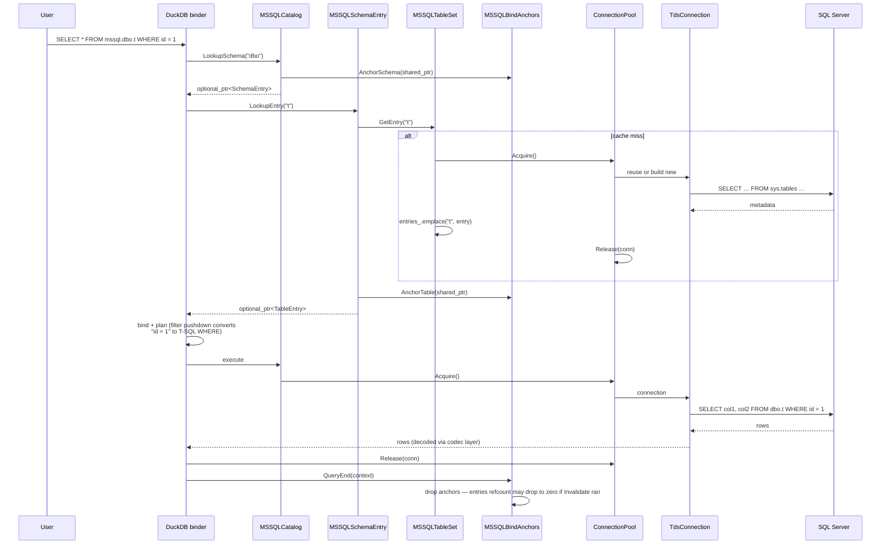
```mermaid
sequenceDiagram
    participant U as User
    participant DD as DuckDB binder
    participant Cat as MSSQLCatalog
    participant Sch as MSSQLSchemaEntry
    participant TS as MSSQLTableSet
    participant BA as MSSQLBindAnchors
    participant Pool as ConnectionPool
    participant Conn as TdsConnection
    participant SQL as SQL Server

    U->>DD: SELECT * FROM mssql.dbo.t WHERE id = 1
    DD->>Cat: LookupSchema("dbo")
    Cat->>BA: AnchorSchema(shared_ptr)
    Cat-->>DD: optional_ptr<SchemaEntry>
    DD->>Sch: LookupEntry("t")
    Sch->>TS: GetEntry("t")
    alt cache miss
        TS->>Pool: Acquire()
        Pool->>Conn: reuse or build new
        Conn->>SQL: SELECT … FROM sys.tables …
        SQL-->>Conn: metadata
        TS->>TS: entries_.emplace("t", entry)
        Pool->>Pool: Release(conn)
    end
    Sch->>BA: AnchorTable(shared_ptr)
    Sch-->>DD: optional_ptr<TableEntry>
    DD->>DD: bind + plan (filter pushdown converts<br/>"id = 1" to T-SQL WHERE)
    DD->>Cat: execute
    Cat->>Pool: Acquire()
    Pool->>Conn: connection
    Conn->>SQL: SELECT col1, col2 FROM dbo.t WHERE id = 1
    SQL-->>Conn: rows
    Conn-->>DD: rows (decoded via codec layer)
    DD->>Pool: Release(conn)
    DD->>BA: QueryEnd(context)
    BA->>BA: drop anchors — entries refcount may drop to zero if Invalidate ran
```

---

## The write path (spec 057)

Everything above describes reading. The write path — `COPY … TO`, `CREATE TABLE … AS SELECT`
— reuses layers 1, 2 and 5 but owns connections and threads differently enough that
the read-path picture is actively misleading about it.

Both operators are DuckDB **sinks with `ParallelSink() == true`**, so DuckDB drives
them from every worker thread at once.

### Who owns which connection

This is the part that has changed most, and the two operators deliberately differ:

| | connection for the DDL | connection(s) for the rows | inside an explicit transaction |
|---|---|---|---|
| `COPY … TO` | pool (`ExecuteDDL`, autocommits) | pool, one per writer | **pinned**, and exactly one writer — a second would sit outside the transaction, and COPY may be loading into a table it cannot undo |
| CTAS | pool (`ExecuteDDL`, autocommits) | pool, one per writer | **unchanged** — never pinned, still N writers |

Since spec 063 that answer comes from ONE function rather than from each operator
deriving it: `MSSQLResolveLoadPolicy` (`copy/load_policy.hpp`) reduces the whole
question to a single predicate about the TARGET —

> can a session other than the one driving the statement see it, and may its rows
> land outside the current transaction?

A `#local` temp table answers no to the first (it lives only in its creating
session, so **one writer** whatever the thread count); a target in a transaction
whose rows must roll back answers no to the second; CTAS's own new table answers
yes to both. `##global` is visible across sessions and keeps its N writers, which
is why the flag the policy reads is the LOCAL temp one and not
`BCPCopyTarget::IsTempTable()`, which merges the two.

The one input that differs per operator is stated as a property of the STATEMENT
— `MSSQLLoadTransactionRole::JoinsTransaction` for COPY, `OwnsTarget` for CTAS —
so a future consumer (INSERT via BCP, the `#temp` staging table UPDATE/DELETE
will fill) answers the same question rather than adding a branch.

CTAS is outside the transaction on purpose. One connection cannot stream a result
set and receive a bulk load at the same time, so pinning it made
`BEGIN; CREATE TABLE t AS SELECT * FROM <the same catalog>` fail against itself, and
capped every in-transaction CTAS at one writer. The undo for a table the statement
CREATED is dropping it, which is complete and needs no shared transaction — that is
what `mssql_ctas_drop_on_failure` does. The consequence, which is asserted rather
than tolerated: `ROLLBACK` undoes neither a CTAS's table nor its rows.

### Writers

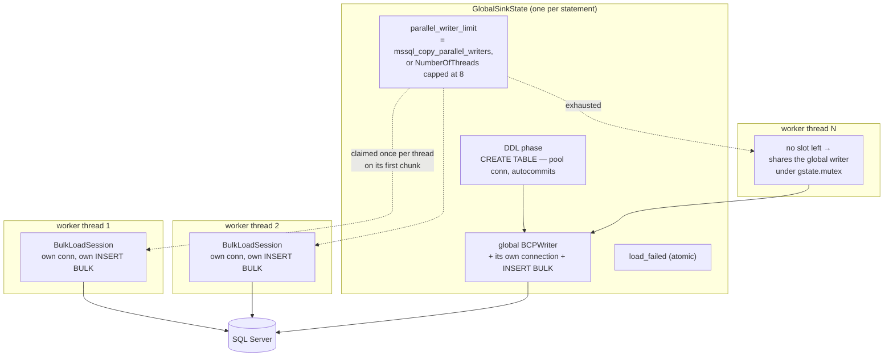
```mermaid
flowchart TD
    subgraph GS["GlobalSinkState (one per statement)"]
        ddl["DDL phase<br/>CREATE TABLE — pool conn, autocommits"]
        gw["global BCPWriter<br/>+ its own connection + INSERT BULK"]
        lim["parallel_writer_limit<br/>= mssql_copy_parallel_writers,<br/>or NumberOfThreads capped at 8"]
        failed["load_failed (atomic)"]
    end
    subgraph T1["worker thread 1"]
        lw1["BulkLoadSession<br/>own conn, own INSERT BULK"]
    end
    subgraph T2["worker thread 2"]
        lw2["BulkLoadSession<br/>own conn, own INSERT BULK"]
    end
    subgraph T3["worker thread N"]
        shared["no slot left →<br/>shares the global writer<br/>under gstate.mutex"]
    end
    ddl --> gw
    lim -.claimed once per thread<br/>on its first chunk.-> lw1
    lim -.-> lw2
    lim -.exhausted.-> shared
    lw1 --> srv[(SQL Server)]
    lw2 --> srv
    gw --> srv
    shared --> gw
```

`mssql::BulkLoadSession` (`copy/bulk_load_session.hpp`) is that per-thread writer,
and there is ONE of it: COPY and CTAS grew separate copies in the same week and had
diverged nine ways within it — `ROWS_PER_BATCH` sent by one and not the other, no
interrupt check and no counters on the CTAS side at all. It owns the connection,
the writer, the batch bookkeeping and the mid-bulk-load release protocol; who may
open one, and how many, is the policy above and is handed to it.

A writer is claimed by a **thread**, on its first chunk — not allocated up front —
because `GetLocalSinkState` cannot see the global state, and the `INSERT BULK` text
and resolved columns are only settled by the DDL phase. Failing to get one is **not**
an error: the thread falls back to the shared writer, which is always correct. A load
must not fail because it could not go faster.

The writer count is therefore a **ceiling, not a floor**. With one DuckDB thread
driving the sink, `mssql_copy_parallel_writers = 8` still yields one writer — which is
why the parallel tests pin `SET threads`.

That ceiling is only half-checkable from SQL. The tests assert that
`mssql_copy_parallel_writers = 1` really disables the feature (exactly one pooled
connection created) but cannot assert that the parallel section ran concurrently:
`connections_created` is 2 even single-threaded, because the operator opens the
global writer's connection and the one sink thread then claims a session on top of
it. `MSSQL_COUNTERS=1` reports the truth as `writers=N/M`, but only to stderr.

### Encoding: one resolution per column, one decision per chunk

`codec::ResolveWriteColumnOps(source, target)` maps each column to a `ScatterArm`
once, from the pair of types — never per value. The arms are the columnar kernels
(`DirectCopy1/2/4/8`, `IntConvert`, `FloatConvert`, `Decimal`, `Datetime`, `Guid`,
`VarString`) plus `RowFallback`.

**If any one column resolves to `RowFallback`, the whole chunk goes row-major** —
every other column with it. That is the single fact to keep in mind when touching
this layer: a column type nobody thought about does not cost its own column, it costs
the table. It is why `UTINYINT` mattered (SQL Server `tinyint` reaches the catalog as
UTINYINT, so one such column sent whole tables row-major) and why a HUGEINT column is
the standard way a test forces the row path.

The two paths must produce **identical bytes**. They are separate implementations, so
that is a claim tests have to hold up rather than something the structure guarantees —
`time_rounding_both_paths.test`, `smalldatetime_write.test` and
`string_bound_truncation.test` each load the same values down both and require them to
agree.

### Failure and cleanup

```mermaid
sequenceDiagram
    participant T as failing writer thread
    participant G as GlobalSinkState
    participant O as other writers
    participant S as SQL Server

    T->>T: close own stream, release own connection FIRST
    Note over T: the DROP below takes a schema lock on<br/>the table this connection is still loading into
    T->>G: load_failed.exchange(true)
    alt first to fail AND mssql_ctas_drop_on_failure
        T->>S: SET LOCK_TIMEOUT 5000; DROP TABLE …
    end
    O->>G: read load_failed at the top of Sink
    alt drop_on_failure = true
        O->>O: give up — rows in flight are wasted work<br/>holding a session against the table being dropped
    else false (default)
        O->>O: keep going — "keep what landed"
    end
```

Two lifetime rules that are easy to get wrong:

- a connection abandoned **mid-bulk-load is destroyed, not pooled**. Closing the
  socket is what rolls the `INSERT BULK` back server-side and drops its locks, so
  reusing it would leave a half-written load committed. This is why `connections_created`
  climbs by the writer count after each failed load while `active_connections` stays 0 —
  churn by design, not a leak;
- a CTAS killed from **outside** the sink (a cast in the `SELECT`, a read error, a
  cancelled query) never reaches either catch block, so the cleanup also hangs off
  `~CTASExecutionState`. It runs without a `ClientContext` — through `pool_handle`,
  not `catalog`, which may already be gone (issue #178) — guarded by `table_created`
  and `cleanup_attempted`.

---

## Per-spec map

| Spec | What it added at the data-model level |
|---|---|
| 042 | `AuthenticationStrategy` / `IAuthenticator` (Kerberos/SSPI) in layer 1 |
| 045 | Family-dispatch codec layer 5 |
| 047 | Per-catalog `unique_ptr<ConnectionPool>` (was process-wide); per-catalog `active_streams_`; `TokenCache` keyed by `(DatabaseInstance*, key)` |
| 051 | `src/include/mssql_compat.hpp` — DuckDB API shims (header relocation, single-arg `BindScalarFunctionInput`) |
| 052 | `shared_ptr` ownership for schema/table entries + `enable_shared_from_this`; `MSSQLBindAnchors` per-ClientContext anchor holder; `MSSQLTableSet` singleflight loader; `MSSQLTableEntry::pk_load_mutex_` double-checked PK load |
| #178 | Single cache-wide mutex in `MSSQLMetadataCache` (was split across two, Refresh raced readers → UAF); atomic TTL/timeout config fields; `known_table_names_` consistently under `names_mutex_` (Scan was mutating it under `entry_mutex_`); thread-safe magic-static debug-level init everywhere |
| 060 | `codec/target_string_type` — a string column's stated SQL Server type on the `LogicalType` (layer 5), read by both DDL translators and the BCP metadata builders. **Layer 3 now reports it**: `MSSQLTableEntry` hands DuckDB `MSSQLColumnInfo::NativeDuckDBType()` rather than a bare VARCHAR, gated by `mssql_catalog_native_types` — which is why the filter encoder had to learn to see through the no-op cast DuckDB inserts. `MSSQLCatalog` gains the collation rules (`ResolveVarcharCollation`, `WireVarcharCollation`) and the endpoint guarantees (`RequiresSingleByteText`, `ValidateStringTargets`, `ValidateTableOptions`) so CREATE TABLE, CTAS and COPY cannot drift apart on them |
| 057 | The write path above. `codec::ResolveWriteColumnOps` resolves a `ScatterArm` per column so the encode loop carries no type test, and one `RowFallback` takes the whole chunk row-major. Both sinks become `ParallelSink`, with writers claimed per thread on first chunk against a `parallel_writer_limit`. CTAS stops using the transaction's pinned connection entirely — its DDL and its rows both go to pool connections, so `ROLLBACK` undoes neither and the compensation is `mssql_ctas_drop_on_failure`'s DROP, wired to `~CTASExecutionState` as well as to the sink's catch blocks. `LogicalTypeId::UTINYINT` becomes the resolved type of a SQL Server `tinyint` column (one unsigned byte), leaving `TINYINT` to mean a signed source that travels as a smallint |

## Where to read the code

- Catalog ownership: `src/include/catalog/mssql_catalog.hpp`, `src/catalog/mssql_catalog.cpp`
- Singleflight: `src/include/catalog/mssql_table_set.hpp`, `src/catalog/mssql_table_set.cpp`
- Bind anchors: `src/include/catalog/mssql_bind_anchors.hpp`, `src/catalog/mssql_bind_anchors.cpp`
- Pool: `src/include/tds/tds_connection_pool.hpp`, `src/tds/tds_connection_pool.cpp`
- TDS connection: `src/include/tds/tds_connection.hpp`, `src/tds/tds_connection.cpp`
- DuckDB API shims: `src/include/mssql_compat.hpp`
- Codec dispatch: `src/codec/type_family.cpp`, `src/codec/literal_format.cpp`
- Target string types: `src/include/codec/target_string_type.hpp`, `src/codec/target_string_type.cpp`
- BCP column metadata (both builders): `src/copy/target_resolver.cpp`
- Write-path column resolution (the `ScatterArm` table): `src/codec/write_column_ops.cpp` — and [`docs/columnar-encode-core.md`](docs/columnar-encode-core.md), a reader's guide to the six files that make up the encode core, with the invariants that have actually broken
- Row-major encoder (the fallback both paths must agree with): `src/tds/encoding/bcp_row_encoder.cpp`
- BCP framing and the streaming drain: `src/copy/bcp_writer.cpp`
- CTAS sink and its parallel writers: `src/dml/ctas/mssql_physical_ctas.cpp`, `src/dml/ctas/mssql_ctas_executor.cpp`
- COPY sink and its parallel writers: `src/copy/copy_function.cpp`
